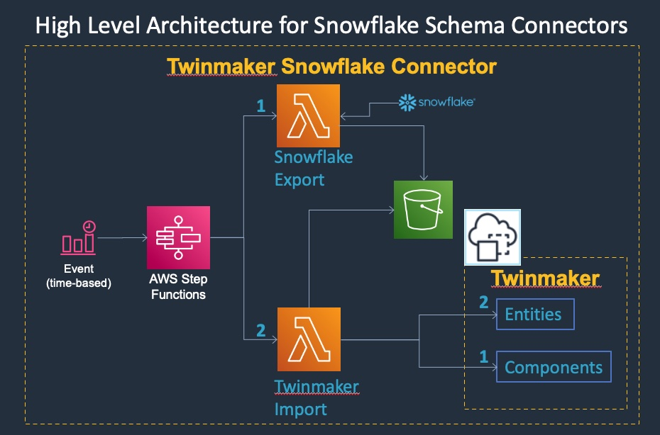
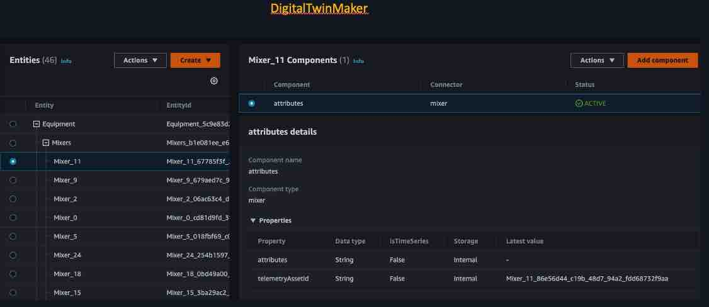
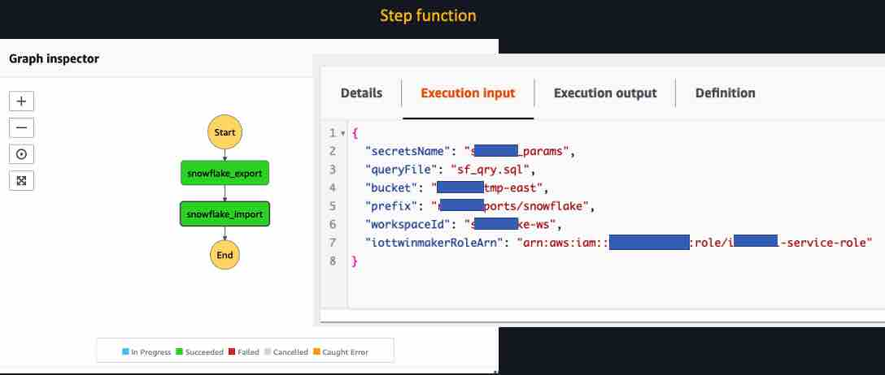
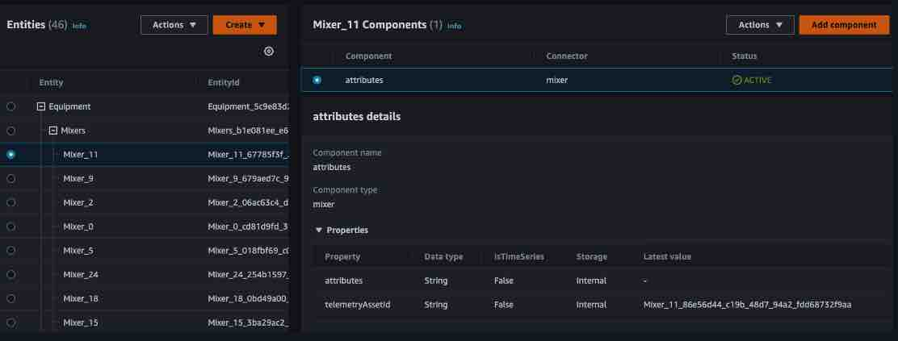

# Migrating Snowflake Assets to IoT TwinMaker 
## Summary
With this Snowflake module, you can extract asset information from snowflake database and store it in S3 as JSON file. This json file can then be imported into IoT TwinMaker as entities. The module allows you to extract data using your SQL query, so you can define the hierarchy of the model via the SQL query. This migration can be achieved either by manually executing the export and import scripts or by executing the step function that is created when you deploy this module as CDK.



## Prerequisite
Check out the latest code from https://github.com/aws-samples/aws-iot-twinmaker-snowflake. Let's call this directory "IoTTwinMakerHome."

Create a secret in secret managerwith the following key (used to connect to snowflake);

USER
PASSWORD
ACCOUNT
ROLE
WAREHOUSE
DATABASE
SCHEMA


## Execute as stand-alone script
```
export IoTTwinMakerHome=<Directory where your checked out the code>
export PYTHONPATH=.:${IoTTwinMakerHome}/src/modules/snowflake/sync-connector-lambda:${IoTTwinMakerHome}/src/modules/snowflake/snowflake-python-and-boto3/python:$PYTHONPATH
# where IoTTwinMakerHome is the directory where you checked out the code.
```

### To export the snowflake models and assets from iot snowflake to S3
```
cd ${IoTTwinMakerHome}/src/modules/snowflake/
python migration.py
    -b  --bucket                    The bucket to exported snowflake artifacts to.
                                    e.g. my-tmp-east
    -p  --prefix                    The prefix under which snowflake data will be exported to.
                                    e.g. sf-connectors/sf-export
    -s  --secrets-name              Name of the secret in secret manager that stores snowflake credentials
                                    e.g. sf_conn_params
    -f  --query-file                File containing the query that will be executed against the snowflake data
                                    e.g. sync-connector-lambda/sf_qry.sql
    #-r  --iottwinmaker-role-arn     ARN of the role assumed by Iottwinmaker
    -w  --workspace-id              Workspace id passed to import, optional for export
                                    e.g. sf-ws
    -c  --component-type-id         Component to use
                                    e.g. sf-component

```

## Execute as step function
### Deploy the module using CDK
Check out the latest code from https://github.com/aws-samples/aws-iot-twinmaker-samples.
Deploy with cdk from the snowflake module directory as shown in the following.
```
cd cdk && cdk synth && cdk bootstrap aws://unknown-account/us-east-1 && cdk deploy
```
Execute the step function with the following input. (or schedule it in the event rule that is created as part of the cdk deployment
```
{
    "bucket": "my-tmp-east",
    "entity_prefix": "my-namespace-",
    "prefix": "snowflake/exports",
    "workspace_id": "snowflake",
    "iottwinmaker_role_arn": "arn:aws:iam::00000000000:role/iot-tm-service-role"
}
```

where
```
    bucket                  The bucket containing exported snowflake models
    entity_prefix           Prefix to namespace entities
    prefix                  The prefix to store exported snowflake assets and models
    workspace_id            Workspace id that will be created
    iottwinmaker_role_arn   IAM role that has permissions to create a workspace
```

## Sample execution screenshots






---

## License

This project is licensed under the Apache-2.0 License.
